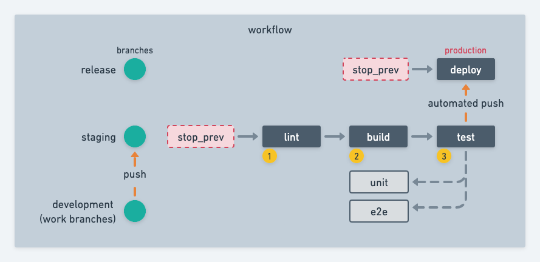

# React template with CI

This project uses [create-react-app](https://create-react-app.dev/) as base to create a basic (but powerfull) CI/CD pipeline blank project with [github actions](https://docs.github.com/es/actions).

## Workflow

This workflow uses at least 3 branches:

1. **release**, main branch with released code (build from staging).
2. **staging**, this branch integrate the code of all working branches.
3. **development**, working branch (optional).

## Jobs
This workflow runs the jobs:

on staging branch push:
1. **stop_prev**, stop previous pipelines
2. **lint**, runs code linter to fix syntax
3. **build**
4. **deploy** to test env
5. **test**, unit and e2e tests
6. **push**, generate automated push to release branch

on release branch push:
1. **stop_prev**, stop previous pipelines
2. **deploy** to production env

---
This project was bootstrapped with [Create React App](https://github.com/facebook/create-react-app).